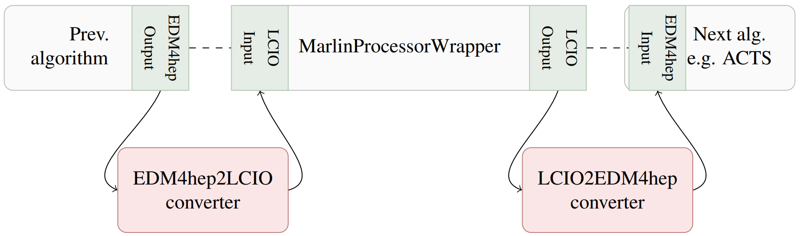

<!--
Copyright (c) 2019-2023 Key4hep-Project.

This file is part of Key4hep.
See https://key4hep.github.io/key4hep-doc/ for further info.

Licensed under the Apache License, Version 2.0 (the "License");
you may not use this file except in compliance with the License.
You may obtain a copy of the License at

    http://www.apache.org/licenses/LICENSE-2.0

Unless required by applicable law or agreed to in writing, software
distributed under the License is distributed on an "AS IS" BASIS,
WITHOUT WARRANTIES OR CONDITIONS OF ANY KIND, either express or implied.
See the License for the specific language governing permissions and
limitations under the License.
-->
# Wrapping Marlin processors in Gaudi

This page describes how to run existing Marlin processors within the Gaudi
framework. `Marlin` and `Gaudi` are two event processing frameworks available in
the Key4hep software stack. The former was originally developed by the linear
collider communities in iLCSoft, while the latter originally comes from LHCb. It
is also the event processing framework for future developments within Key4hep.
To enable using the existing functionality that has been developed for the
linear collider studies and also to allow for a gradual migration the
`MarlinProcessorWrapper` has been developed. It allows to run Marlin processors
within the Gaudi framework and it's usage is described
[below](#the-marlinprocessorwrapper-gaudi-algorithm)

One of the major differences between Marlin processors and (Key4hep) Gaudi
algorithms is the event data model (EDM) that they use. While Marlin uses LCIO,
Gaudi in Key4hep uses [EDM4hep](https://edm4hep.web.cern.ch). Since EDM4hep is
based on LCIO the differences are limited and it is possible to convert between
the two EDMs as necessary. We will also show how to do this
[below](#using-the-edm-converters).

The following descriptions assume that you are somewhat familiar with how to
configure and run Gaudi via `k4run`, i.e. most of the snippets will just show
the bare minimum of configuration, but will usually not work without
modifications (e.g. in most cases the `ApplicationMgr` as well as putting all
the configured algorithms into the list of algorithms to run is missing
entirely).

## The `MarlinProcessorWrapper` Gaudi algorithm

The `MarlinProcessorWrapper` is a standard Gaudi algorithm and can be used just
like all others, i.e. in a Gaudi options file we simply have to import it via
```python
from Gaudi.Configuration import *
from Configurables import MarlinProcessorWrapper
```

It can then be configured just like any other algorithm by instantiating it and
passing the necessary parameters to it. Each Marlin processor that you want to
wrap needs its own instance. The main configuration parameters for the
`MarlinProcessorWrapper` are
- `ProcessorType` - a string with the **Marlin processor type**. The type is
  usually the class name of the Marlin processor, and corresponds to the `type`
  attribute in a Marlin XML configuration for a processor.
- `Parameters` - a dictionary of string keys and **list of string** values. Each
  parameter of the Marlin processor needs its own entry in this dictionary and
  all parameter values have to be strings as the parsing is done internally.

As a very brief example; The following snippet of a Marlin XML steering file
```xml
  <processor name="StatMonitorAlg" type="StatusMonitor">
    <parameter name="HowOften" type="int">1</parameter>
  </processor>
```

could be converted to the following snippet of a Gaudi options file

```python
StatMonitorAlg = MarlinProcessorWrapper("StatMonitorAlg")
StatMonitorAlg.ProcessorType = "StatusMonitor"
StatMonitorAlg.Parameters = {"HowOften": ["1"]}
```

**Note that wrapped Marlin processors still expect their inputs in LCIO
format!** You can either read in the data in that format directly, or use
[converters](#using-the-edm-converters) to convert from EDM4hep to LCIO first.

## Reading and writing LCIO events with Gaudi

In order to read in event data in LCIO format into the Gaudi world it is
necessary to use the `LcioEvent` Gaudi algorithm. It is configured in the same
way as normal Gaudi algorithms, i.e. in a minimal standalone form

```python
from Gaudi.Configurables import *
from Configurables import LcioEvent

read = LcioEvent()
read.Files = ["inputfile1.slcio", "inputfile2.slcio"]
```

For writing LCIO events from Gaudi, simply use a `MarlinProcessorWrapper` to
wrap a `LCIOOutputProcessor`, e.g.

```python
from Configurables import MarlinProcessorWrapper

Output_DST = MarlinProcessorWrapper("Output_DST")
Output_DST.ProcessorType = "LCIOOutputProcessor"
Output_DST.Parameters = {
                         "DropCollectionNames": [],
                         "DropCollectionTypes": ["MCParticle", "LCRelation", "SimCalorimeterHit"],
                         }
```

## Automatic conversion of Marlin XML steering files

We provide the `convertMarlinSteeringToGaudi.py` converter script to
automatically convert Marlin steering files in XML format to Gaudi options
python files. Usage is as simple as

```bash
convertMarlinSteeringToGaudi.py <input-steering.xml> <output-gaudi-options.py>
```

### Limitations
This converter script handles almost everything, but there are a few
short-comings which it cannot yet handle:
- Marlin XML steering files can have `include` statements, e.g. `<include
  ref="Tracking/TrackingDigi.xml"/>`. These cannot be resolved by the converter
  script, and it will issue a warning. The easiest way to fix this is to simply
  run `Marlin -n` to resolve all these statements and then run the converter
  script again on the output file which will be named
  `<inputfile-base>Parsed.xml`.
- Marlin has a mechanism to resolve constants that are defined in the
  `constants` section and used like `${someFancyConstant}` in the following. The
  converter script and the converted Gaudi options file handle these in general.
  However, it might be necessary to change the values of the constants inside
  the `CONSTANTS` dictionary that can be found at the beginning of the created
  options file. Alternatively one can use `Marlin -n` with e.g.
  `--constant.someFancyConstant=<value>` to set the values in the Marlin
  steering file first and again parse the converted output.
- Marlin supports conditional execution of processors via the `condition` tag.
  These conditions can be configured via constant values from the `constants`
  section in the steering file, but in principle these can also be runtime
  values that are set, e.g. by a previously run processor. At the moment dynamic
  conditions (where the value might change on an event by event basis) are not
  supported by Gaudi. Additionally static conditions are only partially handled
  by the converter script. While it converts the necessary configuration, it
  will by default not put the converted algorithm into the `algList` list of
  algorithms to run and you might have to comment / uncomment the algorithms you
  actually want to run.
- If the value of the `LCIOInputFiles` is empty in the input XML file, the
  converter script will put a value of `"None"` into the `read.Files` parameter.
  You will have to change this either in the steering file or them in via
  `--LcioEvent.Files`.
- Marlin is in some cases able to replace `constant`s with the values stored in
  environment variables of the same name. In Gaudi these have to be retrieved
  from the environment explicitly via `os.environ`.

## Using the EDM converters

The converters between EDM4hep and LCIO are implemented as so called
`GaudiTool`s. They can be attached to any `MarlinProcessorWrapper` algorithm
that is configured in the Gaudi options file. The tools are called
`Lcio2EDM4hepTool` and `EDM4hep2LcioTool` respectively. Each wrapped processor
can be equipped with both tools, so that it is possible to e.g. convert input
from EDM4hep to LCIO and output from LCIO to EDM4hep again:



The (very) basic usage of the converter tools looks like the following
- Instantiate the necessary tools (and configure them as desired)
- Attach the tools to a wrapped marlin processor via the `Lcio2EDM4hepTool`
  and/or `EDM4hep2LcioTool` options

```python
from Configurables import EDM4hep2LcioTool, Lcio2EDM4hepTool

edm4hep2LcioConv = EDM4hep2LcioTool("EDM4hep2Lcio")
lcio2edm4hepConv = Lcio2EDM4hepTool("Lcio2EDM4hep")

wrappedProcAlg = MarlinProcessorWrapper("ProcessorToWrap")
wrappedProcAlg.Lcio2EDM4hepTool = lcio2edm4hepConv
wrappedProcAlg.EDM4hep2LcioTool = edm4hep2LcioConv
```

An arbitrary number of converter tools can be instantiated and attached to Gaudi
algorithms (taking into account that each algorithm can at most have one
converter for each direction attached). If you have multiple tools make sure to
give them meaningful names in order to avoid any confusion.

### Configuration options

By default each converter tool will try to convert the complete event content
that is currently available in the transient event store for the corresponding
source format. **It will skip the conversion of a collection if the same
collection already exists in the other format. This check is done by collection
name.** However, it is possible to control the conversion process with a
slightly higher granularity with two options that can be configured
- `collNameMapping` - this is a dictionary of collection names, where a *source*
  collection name is mapped to a *target* collection name during the conversion.
  This makes it possible to rename collections on the fly. In combination with
  the `convertAll` option this also allows to select the collections that should
  be converted. In that case if you want to keep the original collection name
  you can simply repeat it.
- `convertAll` - set this to `False` if you do not want to convert all
  collections, but rather would like to select a subset to convert.

As an example, if you only want to convert the `MCParticles` collection, you
would configure the tool like this
```python
edm4hep2LcioConv = EDM4hep2LcioTool("EDM4hep2Lcio")
edm4hep2LcioConv.convertAll = False
edm4hep2LcioConv.collNameMapping = {"MCParticles": "MCParticles"}
```

On the other hand if you want to convert all collections, but rename the
`MCParticle` (LCIO) input collection to the `MCParticles` (EDM4hep) output
collection in the process, you would configure the tool like so

```python
lcio2edm4hepConv = Lcio2EDM4hepTool("Lcio2EDM4hep")
lcio2edm4hepConv.collNameMapping = {"MCParticle": "MCParticles"}
```
